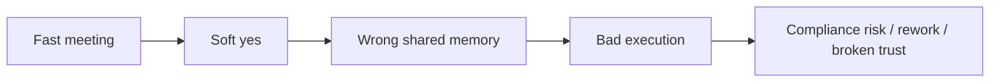
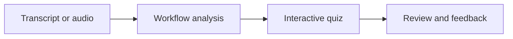
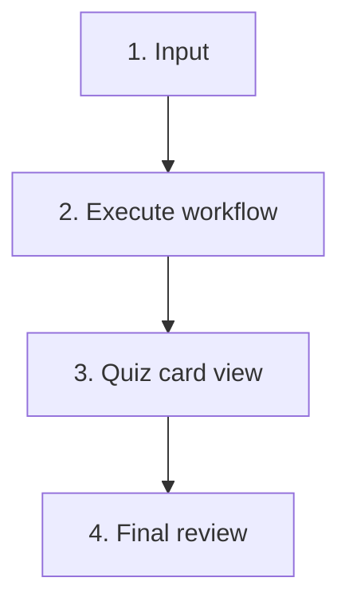
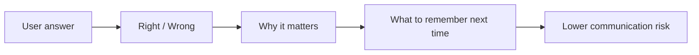
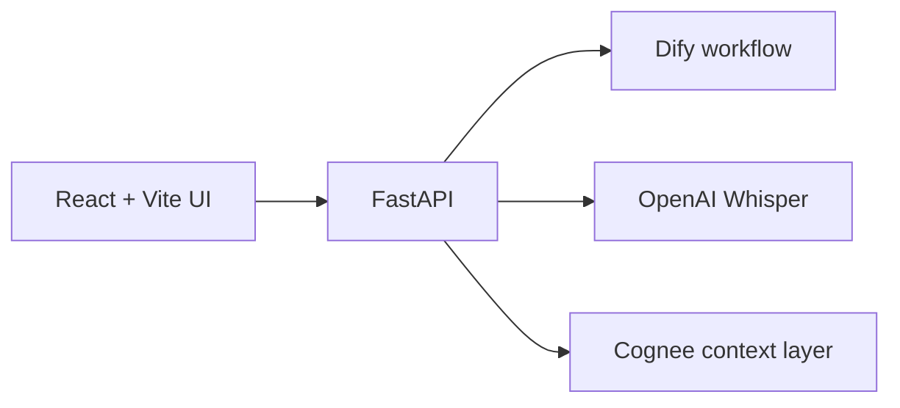

# BrainSync Auditor

Turn meeting agreement into verified understanding.

Catch false confidence before it becomes execution.

<!--
Short opening:
- Teams often say yes too quickly.
- BrainSync checks whether that yes was actually informed.
-->

---
layout: center
---

# The Problem

Most tools record meetings.  
<strong>BrainSync verifies whether people actually remembered the right rule.</strong>

---

# What The Service Does

  

    <h3>Before</h3>
    
A meeting ends with vague agreement.

  

  

    <h3>After</h3>
    
The team sees what was right, wrong, and risky.

  

---

# Product Flow

  
Paste text, upload file, or record audio

  
FastAPI sends transcript to Dify

  
User answers one card at a time

  
Overview explains mistakes and memory gaps

<!--
This is the simplest explanation of the product.
Keep it to one sentence per box.
-->

---

# Why Quiz Instead Of Summary

  

    <h3>Summary</h3>
    <ul>
      <li>What was said</li>
      <li>Passive review</li>
      <li>Easy to miss wrong assumptions</li>
    </ul>
  

  

    <h3>BrainSync</h3>
    <ul>
      <li>What was retained</li>
      <li>Active verification</li>
      <li>Exposes false confidence quickly</li>
    </ul>
  

---

# Demo Example

## Berlin Hackathon conflict audio

- asset: `demo_assets/berlin_hackathon_conflict.wav`
- script: `demo_assets/berlin_hackathon_conflict_script.txt`

## Ground truth

- max 4 team members
- repo must stay public under MIT
- demo is strictly 5 minutes
- both Cognee and Dify must appear

## What goes wrong

- a fifth member is proposed
- repo is made private
- hallway rumor changes the demo time
- the team half-listens and agrees anyway

---

# Review Screen Value

The final screen is the key differentiator.

<ul>
  <li>Not just score</li>
  <li>Not just explanation</li>
  <li>It coaches better approval behavior</li>
</ul>

---

# Architecture

  

    <h3>Frontend</h3>
    
Input, quiz cards, review UI

  

  

    <h3>Backend</h3>
    
Transcription and workflow execution

  

  

    <h3>Cognee</h3>
    
Next step: graph-backed feedback via REST

  

---

# What Makes It Useful

  

    <h3>Business value</h3>
    <ul>
      <li>Fewer wrong approvals</li>
      <li>Better policy recall</li>
      <li>Less rework after meetings</li>
    </ul>
  

  

    <h3>Ideal use cases</h3>
    <ul>
      <li>Compliance reviews</li>
      <li>Architecture decisions</li>
      <li>High-stakes launch meetings</li>
    </ul>
  

---

# Demo Script

1. Upload `demo_assets/berlin_hackathon_conflict.wav`
2. Run workflow
3. Show quiz cards catching the false approvals
4. Open final review
5. Show:
   - what was remembered wrong
   - why the rule matters
   - what to remember next time
   - Cognee evidence / graph area

Message to audience:  
<strong>BrainSync turns “I think that sounds right” into “I know this decision is aligned.”</strong>

---
layout: end
background: linear-gradient(135deg, #0f172a 0%, #1d4ed8 48%, #22d3ee 100%)
---

# BrainSync Auditor

Verify memory before miscommunication becomes execution.
