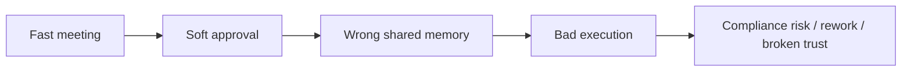
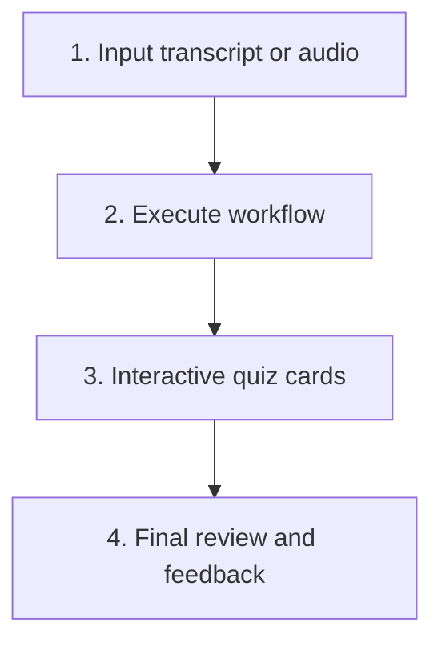
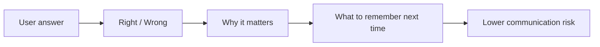
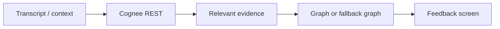
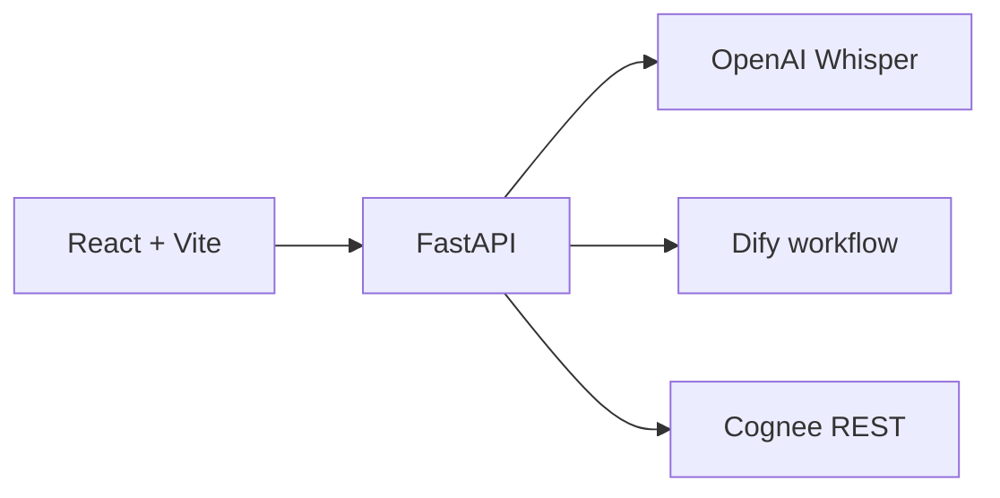

# BrainSync Auditor

Turn meeting agreement into verified understanding.

Catch false confidence before it becomes execution.

<!--
Opening:
- People say yes in meetings very easily.
- BrainSync checks whether that yes was actually informed.
-->

---
layout: center
---

# The Problem

Most tools record meetings.  
<strong>BrainSync verifies what people actually remembered.</strong>

---

# Current Product Flow

  
Whisper turns audio into transcript

  
Dify returns quiz questions from the conversation

  
User answers one question at a time

  
Review explains what was wrong and what to remember

---

# Why Quiz Instead Of Summary

  

    <h3>Summary</h3>
    <ul>
      <li>What was said</li>
      <li>Passive review</li>
      <li>Easy to miss wrong assumptions</li>
    </ul>
  

  

    <h3>BrainSync</h3>
    <ul>
      <li>What was retained</li>
      <li>Active verification</li>
      <li>Exposes false confidence quickly</li>
    </ul>
  

---

# Demo Scenario

## Berlin Hackathon conflict audio

- `demo_assets/berlin_hackathon_conflict.wav`
- `demo_assets/berlin_hackathon_conflict_script.txt`

## Ground truth

- max 4 team members
- repo must stay public under MIT
- demo is strictly 5 minutes
- both Cognee and Dify must appear

---

# What Goes Wrong

  

    <h3>Wrong approval</h3>
    
A fifth member is accepted to improve the UI.

  

  

    <h3>Risky shortcut</h3>
    
The repository is made private “for safety.”

  

  

    <h3>Memory drift</h3>
    
A hallway rumor changes the presentation time.

  

The conversation sounds efficient.  
<strong>The retained decisions are dangerous.</strong>

---

# Review Screen Value

The final review is the product differentiator.

<ul>
  <li>Not just a score</li>
  <li>Not just an explanation</li>
  <li>It coaches better decision behavior</li>
</ul>

---

# Why Cognee Matters

  

    <h3>Native graph path</h3>
    
Use dataset_id from search response, then fetch dataset graph.

  

  

    <h3>Fallback graph path</h3>
    
If native graph is unavailable, BrainSync builds a graph from query, answer, and evidence.

  

---

# Architecture

  

    <h3>Frontend</h3>
    
Input, quiz cards, review, graph rendering

  

  

    <h3>Backend</h3>
    
Transcription, workflow calls, Cognee integration

  

  

    <h3>Security</h3>
    
Keys and API handling stay on the server

  

---

# Live Demo Script

1. Upload `demo_assets/berlin_hackathon_conflict.wav`
2. Show the transcript
3. Click `Execute workflow`
4. Let Step 1 and Step 2 auto-collapse
5. Answer one question wrong on purpose
6. Open the final review
7. Show:
   - what was wrong
   - what to remember
   - Cognee evidence
   - graph or fallback graph

Message to audience:  
<strong>BrainSync turns “I think that sounds right” into “I know this decision is aligned.”</strong>

---
layout: end
background: linear-gradient(135deg, #0f172a 0%, #1d4ed8 48%, #22d3ee 100%)
---

# BrainSync Auditor

Verify memory before miscommunication becomes execution.
